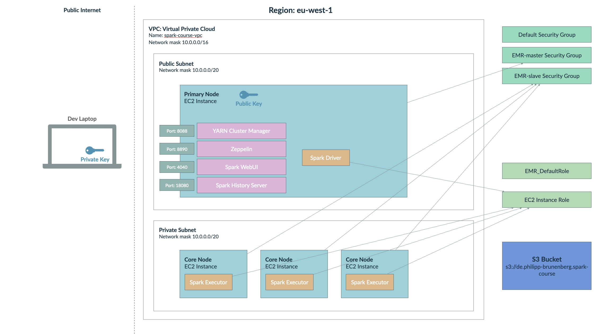

# Deploy PySpark Application to AWS EMR

## Deployment Diagram



## Setup CLI

- Create an AWS account if you don't have one
- Create an access key for your user (in IAM)
- Install aws-cli on your laptop (e.g. using brew)
- Configure the AWS CLI (see below)
  - Add the configuration for your default profile
  - If you do not specify a profile in the `aws` command, it will use the default profile
- Test with `aws s3 ls`; this should list the buckets in your account

```
# ~/.aws/credentials
[default]
aws_access_key_id = <id>
aws_secret_access_key = <key>
```

## Create a Bucket

- Use the console to create a bucket

## Create a VPC (virtual private cloud)

- Choose the correct region (in my case 'eu-west-1')
- Select 'VPC and more' option
- Leave network mask as is
- Create one availability zone (e.g. 'eu-west-1a')
- Create one public subnet
- Bonus: If you like, create also a private subnet, which you can place the core nodes in later

## Create an EMR cluster

- Select: Spark, HDFS, Zeppelin
- Nodes
  - 1 Primary: Instance type: m5.xlarge
  - 1 Core: Instance type: m5.xlarge
  - Remove the task instance group altogether
- Select previously created VPC & public subnet
- Security Groups
  - Leave 'Create ElasticMapReduce-Primary' and 'Create ElasticMapReduce-Core'
- Cluster Logs
  - Select previously created s3 bucket
- Use default EC2 security groups
- Security configuration and EC2 key pair
  - Create a new key pair and download the `.pem` file
  - In EMR, select the created key
  - Move `.pem` file to `<project-dir>/scripts`
- IAM Settings
  - Service Role: EMR_DefaultRole
  - EC2 Instance Profile: Create new profile with access to bucket
- Click 'Create Cluster'

Notes:
- Primary instances run primary components of distributed applications (YARN, HDFS name node)
- The primary node is accessible via SSH, to view logs, access WebUIs
- Core instances are managed by the primary instances (e.g., Spark Executors)
- Task Nodes: only parallel execution nodes; don't run data node daemon
- The Service Role is assumed by EMR itself to manage clusters (provision/scale nodes etc.)
- The EC2 Instance Role specifies the permissions for the application running in an EC2 instance in the cluster

## Allow s3 access

- Go to IAM -> Roles -> Select your previously created Instance Profile
- Add Permissions -> Add `S3FullAccess`

## Connect SSH & port forwarding

- from the EMR cluster properties, find the security group ('Network and security' -> 'EC2 security groups' -> 'Primary Node'; click the security group)
- add new inbound rule to the security group: Select 'Custom TCP', Port=22, Source='My IP'
- this will allow ssh connections only from your laptop's current IP; you will have to update if you change networks
- adjust key permissions: `chmod 600 <project-dir>/scripts/<your-key-file>.pem`
- find the 'primary node public DNS' from the cluster overview page
- set key file and cluster host in environment in `./scripts/env.sh`
- run `source scripts/env.sh` to add all variables to the current environment
- run `./scripts/connect-ssh.sh`
- the script also forwards the web-UI ports to your localhost so that you can access them using your web browser

Port Forwarding

- the primary node hosts application web-UIs
- we need to set up port forwarding to be able to access them from our laptop
- we will use ssh port-forwarding to route traffic from localhost to the primary node
- the alternative would be to add rules for the respective ports to the security group (as we did for ssh)
- you can find the web-UI ports in the cluster overview page and then 'Connect to primary node using ssh'
- the `connect-ssh.sh` script forwards the following ports
  - Yarn Resource Manager: localhost:8088
  - Zeppelin: localhost:8890
  - Spark History Server: localhost:18080

## Deploy Application

Package the application & environment

- run the script `scripts/deploy-application.sh`
- if you use the flag `-p` it will also package the virtual environment using a Docker container with an 'amazonlinux' image; therefore, you will need to have Docker installed and running on your laptop
- the output of the script (the build artifacts will be placed in the `build` directory)
- it packages all sources into a zip-archive called `application.zip`; we will pass this to the spark-submit script using the `--py-files` option
- packaging the virtual environment will result in an artifact called `environment.tar.gz`
- it contains everything from the virtual environment (python interpreter & dependencies)
- we will pass this into the spark-submit script using the `--archives` option
- finally, the script will upload these files and the sources and config to the s3 bucket

Create an AWS config file

- copy your local config and rename it to `conf-aws.json`
- set the paths for the directories to point to the s3 bucket directories
- e.g. `s3://<bucket-name>/data/raw`
- set the Spark config to AWS settings: remove the master configuration (will be set by cluster manager)

Upload the raw data to s3

- `aws s3 cp --recursive data/raw <bucket-name>/data/raw`

Run the application from the primary node command line

- ssh into the primary node using the script `connect-ssh.sh`
- set the bucket environment variable using the first command in `emr-commands.sh`
- then run the spark-submit command from the command line

View the application logs

- use the third command in the `emr-commands.sh` script to view the yarn application logs
- copy and paste the application id which is printed many times in the spark-submit logs

Add an EMR step

- run script
- check in webui
- see logs in s3 bucket
- view logs using yarn on command line
